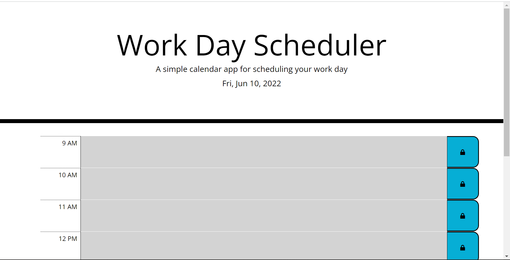

# Work Day Scheduler

### URL: https://smillkaa.github.io/Work-Day-Scheduler/
---
## Description
A simple calendar application that allows a user to save events for each hour of the day.

---
## Technologies Used
- HTML
- CSS
- JavaScript
- Bootstrap
- jQuery
---
## Usage
- This calendar displays the work hours from 9 AM to 5 PM.
- Current day and date is diplayed on top of the page.
- Each time block color represents the past (grey), present(red), and future(green).
- Each time block is an input field and users can save their schedule clicking on the button.
- Saved schedule is stored in the local storage.
- This calendar is desktop and mobile responsive.
---

### Front Page

